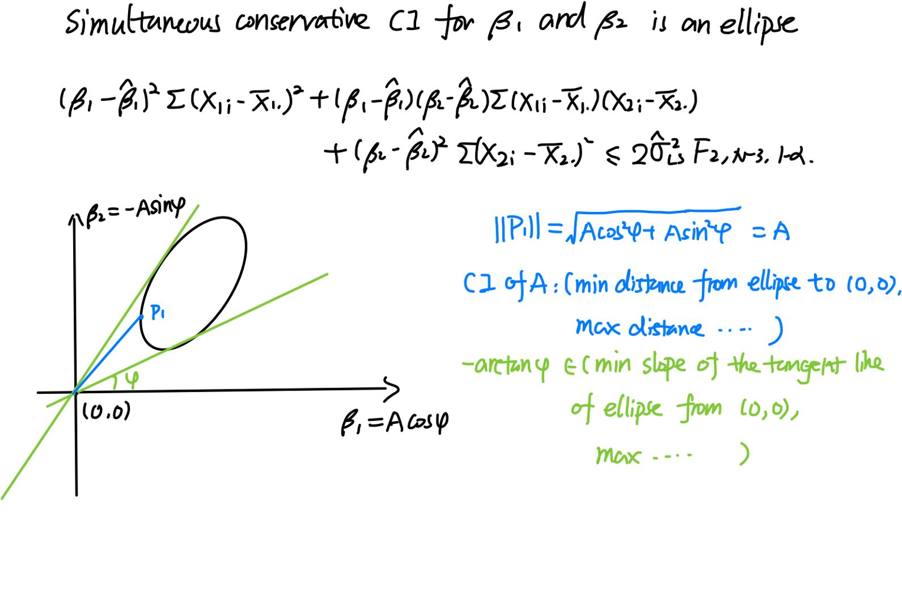
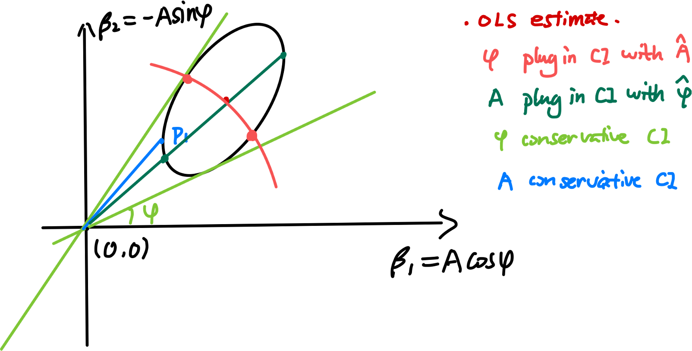

```{r, echo=FALSE}
library(ggplot2)
library(tidyverse)
```


## The rationale
In the previous version of the function, the CI of phase and amplitude is derived from the ellipse using the following rational: 


Such CIs are too conservative. So we will compare with another CI: 

The third CI compared is called Delta CI in this simulation. This is a Wald type CI with the MLE as the center and the standard deviation derived by delta method as the radius. 

##Simulation 
```{r, eval=FALSE}
set.seed(20210529)
amplitude = seq(0.5, 3, length.out = 4)
phase = c(0, pi/2, pi, 3*pi/2)
sim.combs = expand.grid(A = amplitude, phase = phase, rep = 1:10^4)

library(parallel)
#sum(sapply(sim.res, length)!=2)
sim.res = mclapply(1:nrow(sim.combs), function(a){
#sim.res = mclapply(1:160, function(a){
  print(a)
  A = sim.combs$A[a]
  phase = sim.combs$phase[a]
  m = 5; nsample = 20; sigma = 1
  x.time = runif(20, min = 0, max = 24)

  y = m+A*cos(2*pi/24*x.time+phase)+rnorm(20, 0, sigma)
  est.conservative = one_cosinor_OLS(tod = x.time, y = y, alpha = 0.05, period = 24, CI = TRUE, CI.type = "conservative")
  est.PlugIn = one_cosinor_OLS(tod = x.time, y = y, alpha = 0.05, period = 24, CI = TRUE, CI.type = "PlugIn")
  return(list(est.conservative=est.conservative,
              est.PlugIn = est.PlugIn))

}, mc.cores = 40)

saveRDS(sim.res, file = paste0("CI_covarage_simres.rds"))
```

```{r, eval=FALSE}
sim.res = readRDS("CI_covarage_simres.rds") 
#summary 
amplitude = seq(0.5, 3, length.out = 4)
phase = c(0, pi/2, pi, 3*pi/2)
sim.combs = expand.grid(A = amplitude, phase = phase, rep = 1:10^4)
sim.combs2 = expand.grid(A = amplitude, phase = phase)

sim.res2 = do.call(rbind.data.frame, lapply(1:nrow(sim.combs), function(a){
  A = sim.combs$A[a]
  phase = sim.combs$phase[a] 
  if(sim.res[[a]]$est.conservative$test$pval<0.05){
      A.cover = (sim.res[[a]]$est.conservative$A$CI_A[1]<A)&(sim.res[[a]]$est.conservative$A$CI_A[2]>A)
      phase.cover = ((sim.res[[a]]$est.conservative$phase$CI_phase[1]<phase)&(sim.res[[a]]$est.conservative$phase$CI_phase[2]>phase))|((sim.res[[a]]$est.conservative$phase$CI_phase[1]<(phase+2*pi))&(sim.res[[a]]$est.conservative$phase$CI_phase[2]>(phase+2*pi)))|((sim.res[[a]]$est.conservative$phase$CI_phase[1]<(phase-2*pi))&(sim.res[[a]]$est.conservative$phase$CI_phase[2]>(phase-2*pi)))
      A.Delta.cover = (sim.res[[a]]$est.PlugIn$A$CI_A_delta[1]<A)&(sim.res[[a]]$est.PlugIn$A$CI_A_delta[2]>A)
      phase.Delta.cover = ((sim.res[[a]]$est.PlugIn$phase$CI_phase_delta[1]<phase)&(sim.res[[a]]$est.PlugIn$phase$CI_phase_delta[2]>phase))|((sim.res[[a]]$est.PlugIn$phase$CI_phase_delta[1]<(phase+2*pi))&(sim.res[[a]]$est.PlugIn$phase$CI_phase_delta[2]>(phase+2*pi)))|((sim.res[[a]]$est.PlugIn$phase$CI_phase_delta[1]<(phase-2*pi))&(sim.res[[a]]$est.PlugIn$phase$CI_phase_delta[2]>(phase-2*pi)))
      A.PlugIn.cover = (sim.res[[a]]$est.PlugIn$A$CI_A[1]<A)&(sim.res[[a]]$est.PlugIn$A$CI_A[2]>A)
      phase.PlugIn.cover = ((sim.res[[a]]$est.PlugIn$phase$CI_phase[1]<phase)&(sim.res[[a]]$est.PlugIn$phase$CI_phase[2]>phase))|((sim.res[[a]]$est.PlugIn$phase$CI_phase[1]<(phase+2*pi))&(sim.res[[a]]$est.PlugIn$phase$CI_phase[2]>(phase+2*pi)))|((sim.res[[a]]$est.PlugIn$phase$CI_phase[1]<(phase-2*pi))&(sim.res[[a]]$est.PlugIn$phase$CI_phase[2]>(phase-2*pi)))
  }else{
      A.cover = NA
      phase.cover = NA
      A.Delta.cover = NA
      phase.Delta.cover = NA
      A.PlugIn.cover = NA
      phase.PlugIn.cover = NA
  }
  return(data.frame(A = A, phase = phase, A.cover = A.cover, phase.cover = phase.cover, 
                    A.Delta.cover = A.Delta.cover, phase.Delta.cover = phase.Delta.cover, 
                    A.PlugIn.cover = A.PlugIn.cover, phase.PlugIn.cover = phase.PlugIn.cover))
}))

saveRDS(sim.res2, file = paste0("CI_covarage_simres2.rds"))

sim.res2.width = do.call(rbind.data.frame, lapply(1:nrow(sim.combs), function(a){
  A = sim.combs$A[a]
  phase = sim.combs$phase[a] 
  if(sim.res[[a]]$est.conservative$test$pval<0.05){
      A.width = sim.res[[a]]$est.conservative$A$CI_A[2]-sim.res[[a]]$est.conservative$A$CI_A[1]
      phase.width = sim.res[[a]]$est.conservative$phase$CI_phase[2]-sim.res[[a]]$est.conservative$phase$CI_phase[1]
      A.Delta.width = sim.res[[a]]$est.PlugIn$A$CI_A_delta[2]-sim.res[[a]]$est.PlugIn$A$CI_A_delta[1]
      phase.Delta.width = sim.res[[a]]$est.PlugIn$phase$CI_phase_delta[2]-sim.res[[a]]$est.PlugIn$phase$CI_phase_delta[1]
      A.PlugIn.width = sim.res[[a]]$est.PlugIn$A$CI_A[2]-sim.res[[a]]$est.PlugIn$A$CI_A[1]
      phase.PlugIn.width = sim.res[[a]]$est.PlugIn$phase$CI_phase[2]-sim.res[[a]]$est.PlugIn$phase$CI_phase[1]
  }else{
      A.width = NA
      phase.width = NA
      A.Delta.width = NA
      phase.Delta.width = NA
      A.PlugIn.width = NA
      phase.PlugIn.width = NA
  }
  return(data.frame(A = A, phase = phase, A.width = A.width, phase.width = phase.width, 
                    A.Delta.width = A.Delta.width, phase.Delta.width = phase.Delta.width, 
                    A.PlugIn.width = A.PlugIn.width, phase.PlugIn.width = phase.PlugIn.width))
}))

saveRDS(sim.res2.width, file = paste0("CI_width_simres2.rds"))
```

```{r SummaryCoverage}
sim.res2 = readRDS("CI_covarage_simres2.rds") 
sim.res2.list = split(sim.res2, list(sim.res2$A, sim.res2$phase)) 
sim.res2.tab = do.call(rbind.data.frame, lapply(sim.res2.list, function(a){
  one.row = apply(a, 2, mean, na.rm = TRUE)
  one.row[9] = sum(!is.na(a$A.cover))
  return(one.row)
}))
colnames(sim.res2.tab) = c(colnames(sim.res2), "n")
sim.res2.tab2 = sim.res2.tab %>% 
  pivot_longer(cols = ends_with("cover"), names_to = "CI_methods", values_to = "prob_coverage")
sim.res2.tab2$type = gsub("([a-zA-Z]+)\\..*", "\\1", sim.res2.tab2$CI_methods)
sim.res2.tab2$CI_methods = gsub("[a-zA-Z]+\\.(.*)", "\\1", sim.res2.tab2$CI_methods)
sim.res2.tab2$CI_methods = ifelse(sim.res2.tab2$CI_methods == "cover", "Full CI", 
                                  ifelse(sim.res2.tab2$CI_methods == "Delta.cover", "Delta CI", "Plug-in CI"))
sim.res2.tab2$A = round(sim.res2.tab2$A, 2)
plt.coverage = ggplot(sim.res2.tab2, aes(x = phase, y = prob_coverage))+
  geom_point(aes(shape = CI_methods, color = type))+
  scale_y_continuous(breaks = seq(0.35, 1, by = 0.05))+
  facet_grid(.~A)+
  ggtitle("CI coverage (different A in columns)")
print(plt.coverage)
```

From the simulation result we can see that, the CI coverage for both A and phase does not change too much with phase (x axis). When A is large (signal to noise ratio is high, i.e. A = 1.33, 2.17, 3), The Delta CI has the covarage closest to 0.95. 

```{r WidthSummary}
sim.res.width = readRDS("CI_width_simres2.rds") 
sim.res.width.list = split(sim.res.width, list(sim.res.width$A, sim.res.width$phase)) 
sim.res.width.tab = do.call(rbind.data.frame, lapply(sim.res.width.list, function(a){
  one.row = apply(a, 2, mean, na.rm = TRUE)
  one.row[9] = sum(!is.na(a$A.cover))
  return(one.row)
}))
colnames(sim.res.width.tab) = c(colnames(sim.res.width), "n")
sim.res.width.tab2 = sim.res.width.tab %>% 
  pivot_longer(cols = ends_with("width"), names_to = "CI_methods", values_to = "Width")
sim.res.width.tab2$type = gsub("([a-zA-Z]+)\\..*", "\\1", sim.res.width.tab2$CI_methods)
sim.res.width.tab2$CI_methods = gsub("[a-zA-Z]+\\.(.*)", "\\1", sim.res.width.tab2$CI_methods)
sim.res.width.tab2$CI_methods = ifelse(sim.res.width.tab2$CI_methods == "width", "Full CI", 
                                  ifelse(sim.res.width.tab2$CI_methods == "Delta.width", "Delta CI", "Plug-in CI"))
sim.res.width.tab2$A = round(sim.res.width.tab2$A, 2)
plt.width = ggplot(sim.res.width.tab2, aes(x = phase, y = Width))+
  geom_point(aes(shape = CI_methods, color = type))+
  facet_grid(.~A)+
  ggtitle("CI width (different A in columns)")
print(plt.width)
```

The widths of CIs are consistent with the trend of the covarage probability. 
